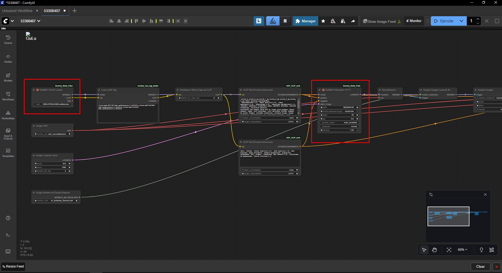

# 🧩 ComfyUI Dummy Node Pack (虚拟节点包)

 

[Español](README.md) | [English](README_EN.md) | [Deutsch](README_DE.md) | [Русский](README_RU.md) | [中文](README_CN.md) | [日本語](README_JP.md)

---

**重新掌控您的工作流。**

这个自定义节点包创建“虚拟节点”（模拟节点），以替换那些旧的、已删除的或特定于云服务的节点（如 A1111、Cloud 等），这些节点会导致 ComfyUI 无法加载工作流。

> ⚠️ **重要：** 这些节点**不处理图像**。它们只是*占位符*，用于在没有错误的情况下可视化加载图表，并保留连接（连线），以便您可以用功能性的原生节点替换它们。

---

## 🚀 为什么要使用这个？

当您加载一个旧的工作流并且缺少节点时，ComfyUI 经常会破坏界面或阻止执行。
这个包解决了“先有鸡还是先有蛋”的问题：
1.  将缺失的节点加载为“Dummies”（虚拟节点）。
2.  允许您查看连线的连接位置。
3.  使您有机会连接原生节点（`Load Checkpoint`、`KSampler` 等）。
4.  修复后，您可以删除虚拟节点。

### 视觉示例


*使用虚拟节点（在红色框中高亮显示）加载的工作流示例，保持了原始连接以便于替换。*

---

## 📋 目前支持的节点

如果您的流程需要以下任何节点，此包将自动将其加载为 🛑 **DUMMY** 节点。

| 缺失节点名称 (ID) | 描述 / 原始用途 | 解决方案 (替换为原生节点) |
| :--- | :--- | :--- |
| `ECHOCheckpointLoaderSimple` | 简单的模型加载器 | **Load Checkpoint** |
| `KSampler_A1111` | Automatic1111 风格的采样器 | **KSampler** (复制 seed/steps 值) |

---

## 🛠️ 安装

1.  转到您的 `ComfyUI/custom_nodes/` 文件夹。
2.  克隆此仓库：
    ```bash
    git clone [https://github.com/YOUR_USERNAME/ComfyUI-Dummy_Node_Pack.git](https://github.com/YOUR_USERNAME/ComfyUI-Dummy_Node_Pack.git)
    ```
3.  重启 ComfyUI。

---

## 🧑‍💻 开发指南：如何添加更多节点

该结构设计为**模块化**的。如果您下载了一个新的流程并且缺少不同的节点（例如 `SuperUpscaler`），请按照以下步骤将其添加到您的本地包中：

### 步骤 1：定义节点
打开 `nodes.py` 文件。复制末尾的模板并进行调整。重要的是定义 `INPUT_TYPES` 以匹配您需要挽救的连线。

```python
# 在 nodes.py 中
class Fake_SuperUpscaler:
    def __init__(self): pass

    @classmethod
    def INPUT_TYPES(s):
        # 在这里定义原始节点具有的输入
        return {"required": { "image": ("IMAGE",), "scale": ("FLOAT", {"default": 1.5}) }}

    RETURN_TYPES = ("IMAGE",)
    FUNCTION = "do_nothing"
    CATEGORY = "Dummy Pack"

    def do_nothing(self, **kwargs): return (None,)
步骤 2：注册节点
打开 __init__.py 文件，导入您的新类，并将其添加到映射中：

Python

# 在 __init__.py 中
from .nodes import Fake_ECHOCheckpointLoaderSimple, Fake_KSampler_A1111, Fake_SuperUpscaler # <--- 1. 导入

NODE_CLASS_MAPPINGS = {
    "ECHOCheckpointLoaderSimple": Fake_ECHOCheckpointLoaderSimple,
    "KSampler_A1111": Fake_KSampler_A1111,
    "SuperUpscaler": Fake_SuperUpscaler # <--- 2. 映射确切的缺失名称
}

NODE_DISPLAY_NAME_MAPPINGS = {
    "SuperUpscaler": "🛑 DUMMY SuperUpscaler" # <--- 3. UI 中的可见名称
}
步骤 3：应用
重启 ComfyUI 并加载您的流程。完成！

📄 许可证
本项目采用 MIT 许可证。您可以自由使用、修改和共享它。


### 6. Japonés (Sugerido): `README_JP.md`

```markdown
# 🧩 ComfyUI Dummy Node Pack (ダミーノードパック)

 

[Español](README.md) | [English](README_EN.md) | [Deutsch](README_DE.md) | [Русский](README_RU.md) | [中文](README_CN.md) | [日本語](README_JP.md)

---

**ワークフローの制御を取り戻しましょう。**

このカスタムノードパックは、ComfyUIでワークフローの読み込みを妨げる、古い、削除された、またはクラウドサービス固有のノード（A1111、Cloudなど）を置き換えるための「フェイクノード（疑似ノード）」を作成します。

> ⚠️ **重要：** これらのノードは**画像を処理しません**。これらは、エラーなしでグラフを視覚的にロードし、接続（ケーブル）を維持して、機能的なネイティブノードに置き換えることができるようにするための*プレースホルダー*です。

---

## 🚀 なぜこれを使うのか？

古いワークフローをロードしてノードが不足している場合、ComfyUIは頻繁にインターフェースを壊したり、実行を妨げたりします。
このパックは「鶏が先か、卵が先か」の問題を解決します：
1.  不足しているノードを「Dummies（ダミー）」としてロードします。
2.  ケーブルがどこに接続されていたかを確認できます。
3.  ネイティブノード（`Load Checkpoint`、`KSampler`など）を接続する機会を与えます。
4.  修正したら、ダミーを削除できます。

### 視覚的な例


*ダミーノード（赤い枠で強調表示）でロードされたワークフローの例。簡単に置き換えるために元の接続が維持されています。*

---

## 📋 現在サポートされているノード

フローがこれらのノードのいずれかを必要とする場合、このパックは自動的にそれを 🛑 **DUMMY** ノードとしてロードします。

| 不足しているノード名 (ID) | 説明 / 元の使用法 | 解決策 (ネイティブに置き換え) |
| :--- | :--- | :--- |
| `ECHOCheckpointLoaderSimple` | シンプルなモデルローダー | **Load Checkpoint** |
| `KSampler_A1111` | Automatic1111スタイルのサンプラー | **KSampler** (seed/steps値をコピー) |

---

## 🛠️ インストール

1.  `ComfyUI/custom_nodes/` フォルダに移動します。
2.  このリポジトリをクローンします：
    ```bash
    git clone [https://github.com/YOUR_USERNAME/ComfyUI-Dummy_Node_Pack.git](https://github.com/YOUR_USERNAME/ComfyUI-Dummy_Node_Pack.git)
    ```
3.  ComfyUIを再起動します。

---

## 🧑‍💻 開発ガイド：ノードを追加する方法

構造は**モジュール式**に設計されています。新しいフローをダウンロードして、別のノード（例：`SuperUpscaler`）が不足している場合は、次の手順に従ってローカルパックに追加します：

### ステップ 1：ノードの定義
`nodes.py` ファイルを開きます。末尾のテンプレートをコピーして適応させます。重要なのは、救出する必要があるケーブルと一致するように `INPUT_TYPES` を定義することです。

```python
# nodes.py 内
class Fake_SuperUpscaler:
    def __init__(self): pass

    @classmethod
    def INPUT_TYPES(s):
        # 元のノードが持っていた入力をここで定義します
        return {"required": { "image": ("IMAGE",), "scale": ("FLOAT", {"default": 1.5}) }}

    RETURN_TYPES = ("IMAGE",)
    FUNCTION = "do_nothing"
    CATEGORY = "Dummy Pack"

    def do_nothing(self, **kwargs): return (None,)
	```
	
### ステップ 2：ノードの登録
__init__.py ファイルを開き、新しいクラスをインポートして、マッピングに追加します：

```python
# __init__.py 内
from .nodes import Fake_ECHOCheckpointLoaderSimple, Fake_KSampler_A1111, Fake_SuperUpscaler # <--- 1. インポート

NODE_CLASS_MAPPINGS = {
    "ECHOCheckpointLoaderSimple": Fake_ECHOCheckpointLoaderSimple,
    "KSampler_A1111": Fake_KSampler_A1111,
    "SuperUpscaler": Fake_SuperUpscaler # <--- 2. 正確な不足名をマッピング
}

NODE_DISPLAY_NAME_MAPPINGS = {
    "SuperUpscaler": "🛑 DUMMY SuperUpscaler" # <--- 3. UIでの表示名
}
```

### ステップ 3：適用
ComfyUIを再起動して、フローをロードします。完了！

## 📄 ライセンス
このプロジェクトは MIT ライセンスの下にあります。自由に使用、変更、共有できます。